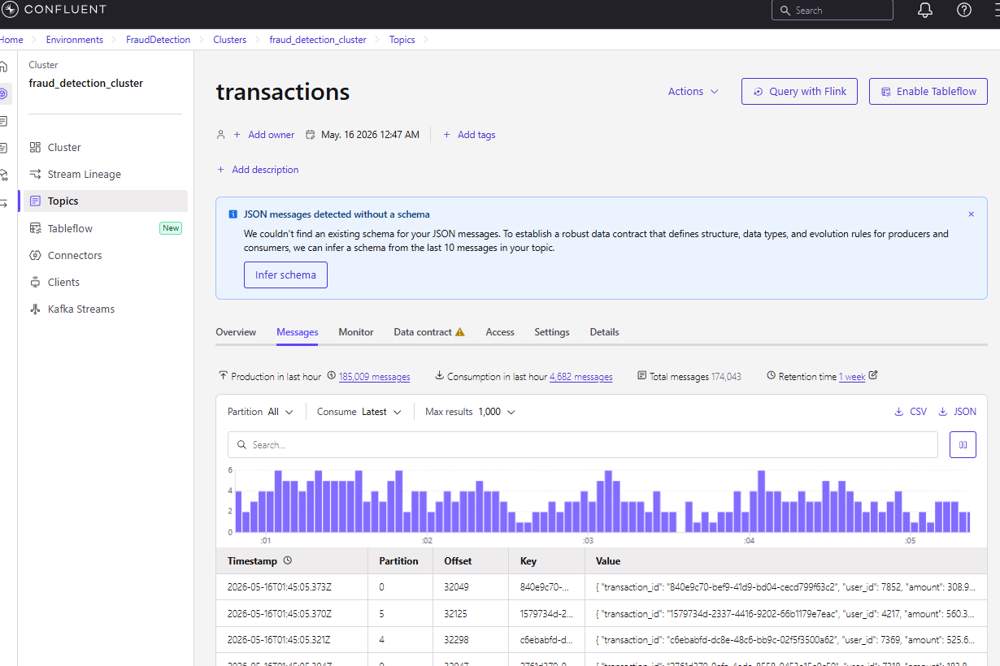

Building a Fraud Detection AI pipeline from Scratch 

Min Sys requirements 
- CPU: 4+ Cores (Intel i5/i7)
- RAM: 16 GB: 8gb ram might slow us down
- GPU: (not required unless using deep learning)
- Python 3.10, XGBoost as model, Pandas, Sklearn 

Prod
(dependaent dataset)
- 16 cores (i9)
- RAM: 64GB  (handling data in memory)
- Storage: 1TB
- GPU: Nvidia rtx 3090
- Softare: Spark/Dask
- Training: XGboost, CatBoost
- Deployment: FastAPI, Flask or MLflow

Cloud
- AWS - ec2 (g5.4xlarge for GPU, Sagemaker for trainier)
-Azure: ml studio
- gcp: co studio

TOols
dOCKER- For containerization and orchestratuin
- python: synthetic data production (3.10)
- kafka: modes can be either zookeeper/careaft mode. confluent cloud
- spark: real time inference
- MLFlow: model registry and artifacts handling
- Minio: For model storage
- Aifrflow: periodic model training
- FLOWER: airflow worker and task scheduling
- Redis: celery message bus

ML Model features
- real time data consumption from kafka
- temporal and behavioural feature engineering
- Class imbalance handling with SMOTE (for handling fraudulent transactions)
- Hyperparameter tuning with randomized searchCV (we switch our values to see patterns, to get the perfect learning rate)
- XGBoost classifier with optimized threshold (we can choose any other classifier to use)
- MLflow experiement tracking 
- Minio s3 integration for model storage
- Comprehensive metrics and viz logging 

1) Python Producer

### Disclaimer 
- 
