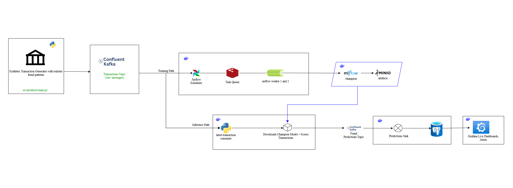

# Real-Time Fraud Detection MLOps Platform

Production-grade real-time fraud detection platform featuring automated MLOps pipelines for training, model promotion, inference, and monitoring. 

---

## Architecture Overview



---

## Project Structure

```
root/
├── src/
│   ├── docker-compose.yml          # Full infrastructure definition (12+ services)
│   ├── config.yaml                 # MLflow + Kafka configuration
│   ├── .env                        # Secrets (Kafka credentials, MinIO, Fernet key)
│   │
│   ├── airflow/
│   │   ├── Dockerfile              # Airflow image with ML dependencies
│   │   └── requirements.txt        # xgboost, mlflow, sklearn, imblearn, etc.
│   │
│   ├── dags/
│   │   ├── fraud_detection_training_dag.py   # Airflow DAG (3 tasks + promotion gate)
│   │   └── fraud_detection_training.py       # Training class (Kafka > XGBoost > MLflow)
│   │
│   ├── producer/
│   │   ├── main.py                 # Synthetic transaction generator
│   │   ├── Dockerfile
│   │   └── requirements.txt
│   │
│   ├── consumer/
│   │   ├── main.py                 # Real-time inference consumer
│   │   ├── Dockerfile
│   │   └── requirements.txt
│   │
│   ├── predictions_sink/
│   │   ├── main.py                 # Writes fraud_predictions > PostgreSQL
│   │   ├── Dockerfile
│   │   └── requirements.txt
│   │
│   ├── mlflow/
│   │   ├── Dockerfile              # MLflow server image
│   │   └── requirements.txt
│   │
│   └── grafana/
│       ├── provisioning/
│       │   ├── datasources/        # Auto-provisioned PostgreSQL datasource
│       │   └── dashboards/         # Dashboard loader config
│       └── dashboards/
│           └── fraud_detection.json  # Pre-built fraud monitoring dashboard
```

---

## ML Pipeline

### Training DAG 
| Task | Description |
|---|---|
| `validate_environment` | Confirms config and secrets are mounted |
| `execute_training` | Full Kafka > feature engineering > XGBoost > MLflow pipeline |
| `promote_model` | Compares new model F1 against current champion; promotes only if better |
| `cleanup_resources` | Removes temporary artefacts |

### Feature Engineering

Raw Kafka fields are enriched with the following features before training and inference:

| Feature | Source | Description |
|---|---|---|
| `amount` | Raw | Transaction value |
| `log_amount` | Engineered | `log1p(amount)` : reduces skew |
| `hour` | Timestamp | Hour of day (0-23) |
| `day_of_week` | Timestamp | Day of week (0=Mon, 6=Sun) |
| `is_weekend` | Timestamp | Binary flag |
| `is_night` | Timestamp | 1 if hour ≥ 22 or ≤ 6 |
| `user_id` | Raw | Numerical user identifier |
| `currency` | Raw (encoded) | OrdinalEncoder |
| `location` | Raw (encoded) | OrdinalEncoder : ISO2 country code |
| `merchant` | Raw (encoded) | OrdinalEncoder |

### Fraud Simulation Patterns (Producer)

| Pattern | Weight | Description |
|---|---|---|
| Account takeover | 40% | High-value txns from compromised user IDs |
| Card testing | 30% | Rapid micro-transactions (< $2) |
| Merchant collusion | 20% | Large amounts at flagged merchants |
| Geographic anomaly | 10% | Impossible location shifts |

### Model Performance (v1: trained on 900k+ transactions)

| Metric | Value |
|---|---|
| Precision | 99.2% |
| Recall | 61.3% |
| F1 Score | 75.8% |
| ROC-AUC | 0.829 |
| Decision threshold | 0.9997 |
| Training fraud rate | 0.307% |

---

## Getting Started

### Prerequisites

- Docker Desktop (with at least 8GB RAM allocated)
- A [Confluent Cloud](https://confluent.io) account with a Kafka cluster and `transactions` + `fraud_predictions` topics created
- Python 3.10+ (for local `.venv` only)

### 1. Clone the repository

```bash
git clone <repo-url>
cd root/src
```

### 2. Configure environment variables

Copy and populate the secrets file:

```bash
cp .env.example .env
```

Required variables:

```env
FERNET_KEY=<generate with: python -c "from cryptography.fernet import Fernet; print(Fernet.generate_key().decode())">
AWS_ACCESS_KEY_ID=minio
AWS_SECRET_ACCESS_KEY=minio123
MINIO_USERNAME=minio
MINIO_PASSWORD=minio123
AIRFLOW_UID=50000
KAFKA_BOOTSTRAP_SERVERS=<your-confluent-cluster>:9092
KAFKA_USERNAME=<confluent-api-key>
KAFKA_PASSWORD=<confluent-api-secret>
KAFKA_TOPIC=transactions
```

### 3. Start all services

```bash
docker compose up -d
```

### 4. Trigger the first training run

```bash
# Unpause the DAG and trigger a manual run
docker exec src-airflow-worker-1 airflow dags unpause fraud_detection_training
docker exec src-airflow-worker-1 airflow dags trigger fraud_detection_training
```

The first run will:
1. Consume all available transactions from Kafka (~15-30 minutes depending on volume)
2. Train and tune the XGBoost model
3. Register it in MLflow as `fraud_detection_xgboost` with the `champion` alias
4. The inference consumer will automatically reload the new champion

---

## Service URLs

| Service | URL | Credentials |
|---|---|---|
| Airflow UI | http://localhost:8080 | airflow / airflow |
| MLflow UI | http://localhost:5500 | |
| Grafana Dashboard | http://localhost:3001 | admin / admin |
| MinIO Console | http://localhost:9001 | minio / minio123 |

---

## Screenshots

### Confluent Kafka: Transactions Topic


### Confluent Kafka: Fraud Prediction Topic


### Grafana: Live Fraud Monitoring Dashboard


### MLflow: Model training


### Minio: Model Registry


## System Requirements

### Minimum 

| Resource | Requirement |
|---|---|
| CPU | 4+ cores (Intel i5/i7 or equivalent) |
| RAM | 16 GB (8 GB allocated to Docker) |
| Storage | 20 GB free |
| GPU | Not required |

---

## Configuration

All tuneable parameters live in `src/config.yaml`:

```yaml
mlflow:
  experiment_name: "fraud_detection"
  registered_model_name: "fraud_detection_xgboost"
  tracking_uri: "http://mlflow-server:5500"
  artifact_location: "s3://mlflow/fraud_detection"
  s3_endpoint_url: "http://minio:9000"
  bucket: "mlflow"

kafka:
  bootstrap_servers: "<confluent-cluster>:9092"
  topic: "transactions"
  output_topic: "fraud_predictions"
```

Key training parameters (in `fraud_detection_training.py`):

| Parameter | Default | Description |
|---|---|---|
| `max_records` | 500,000 | Max Kafka messages consumed per training run |
| `sampling_strategy` | 0.15 | SMOTE target fraud ratio in training set |
| `n_iter` | 15 | RandomizedSearchCV iterations |
| `cv` | 5 | Cross-validation folds |
| `min_recall` | 0.4 | Minimum recall enforced during threshold optimisation |
| `test_size` | 0.2 | Train/test split ratio |
